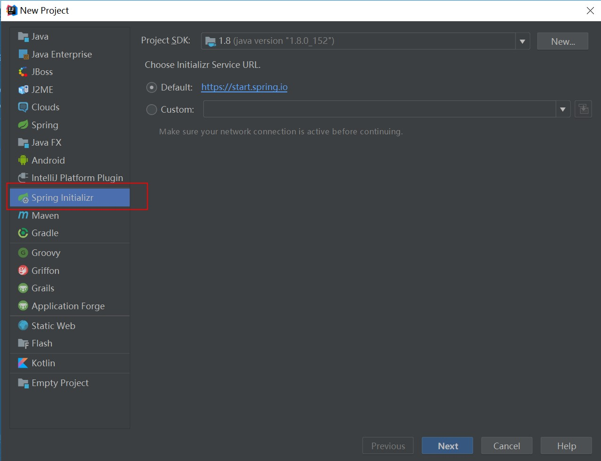
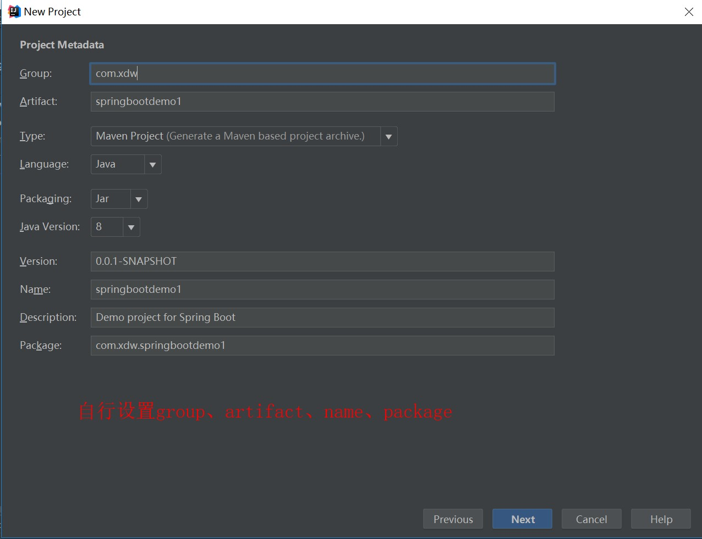
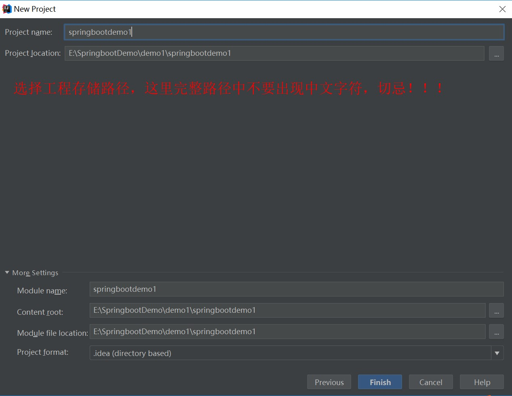
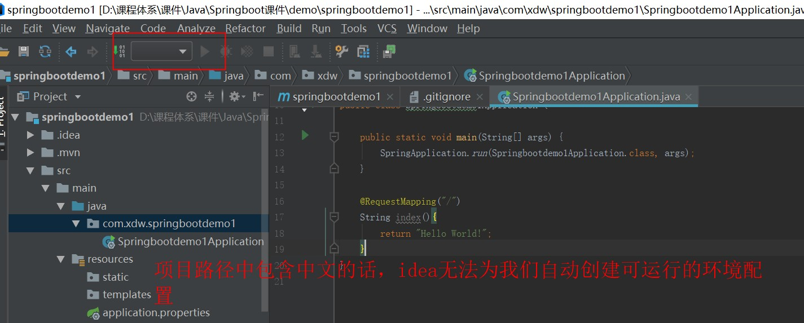
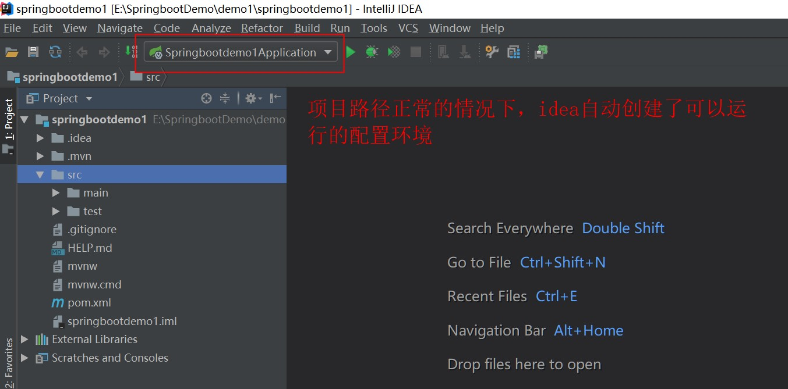
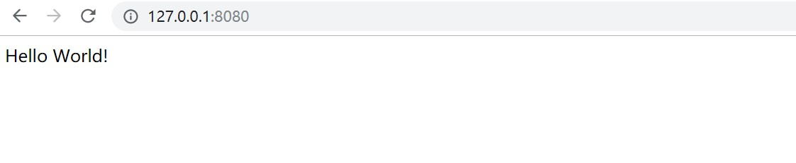

# Springboot入门
## Spring boot简介
Spring Boot是Spring社区发布的一个开源项目，旨在帮助开发者快速并且更简单的构建项目。它使用习惯优于配置的理念让你的项目快速运行起来，使用Spring Boot很容易创建一个独立运行（运行jar，内置Servlet容器，Tomcat、jetty等，默认为tomcat）、准生产级别的基于Spring框架的项目，使用SpringBoot你可以不用或者只需要很少的配置文件。

## Springboot特点：

- Spring Boot设计目的是用来简化新 Spring 应用的初始搭建以及开发过程。 
- 嵌入的 Tomcat，无需部署 WAR 文件 
- Spring Boot 并不是对 Spring 功能上的增强，而是提供了一种快速使用 Spring 的方式。

## SpringBoot项目搭建
1、手工构建maven项目
任意IDE新建空maven项目
修改pom.xml添加Spring Boot的父级依赖Spring-boot-starter-parent，添加之后这个项目就是一个Spring Boot项目了。
2、IDE下直接创建，推荐使用STS(Spring Tool Suite)、IntelliJ IDEA均支持直接搭建，STS是Spring基于eclipse进行二次开发的工具。
Spring Tool Suite　：新建Spring Initializr项目,填写项目信息和选择技术，将项目设置成maven项目。
IntelliJ IDEA：新建Spring Starter project,填写项目信息和选择技术完成maven工程创建。

我后面的讲解都是使用IntelliJ IDEA进行讲解

## 项目搭建案例 HelloWorld
1.Create New Project 新建项目




点击Finish，项目创建完毕。

2、**注意：中文路径的坑**


正常环境下，这个三角形播放按钮时绿色的，点击它即可运行项目

3、打开Springbootdemo1Application的代码，原始代码如下：

```java
package com.xdw.springbootdemo1;

import org.springframework.boot.SpringApplication;
import org.springframework.boot.autoconfigure.SpringBootApplication;

@SpringBootApplication
public class Springbootdemo1Application {

    public static void main(String[] args) {
        SpringApplication.run(Springbootdemo1Application.class, args);
    }

}

```

4、将上述代码进行修改，如下：

```java
package com.xdw.springbootdemo1;

import org.springframework.boot.SpringApplication;
import org.springframework.boot.autoconfigure.SpringBootApplication;
import org.springframework.web.bind.annotation.RequestMapping;
import org.springframework.web.bind.annotation.RestController;

@SpringBootApplication
@RestController
public class Springbootdemo1Application {

    public static void main(String[] args) {
        SpringApplication.run(Springbootdemo1Application.class, args);
    }

    @RequestMapping("/")
    String index(){
        return "Hello World!";
    }
}

```

5、运行项目，在浏览器中输入http://127.0.0.1:8080/


6、代码解释

​    @SpringBootApplication注解代表该程序的入口，就像main函数一样。

@RestController注解的类会被认定为一个标准的restful风格的控制器，配合@RequestMapping注解的方法，都会以字符串形式输出打印到浏览器上。此时该控制器下的方法是不能用来做页面转发和页面重定向的，使用@RestController注解适合用来做纯restful风格接口，适合前后端分离项目开发。

## 思考
如果想在一个控制器中某些方法是rest风格，某些方法是跳转页面，怎么做呢？后面的章节会讲到。