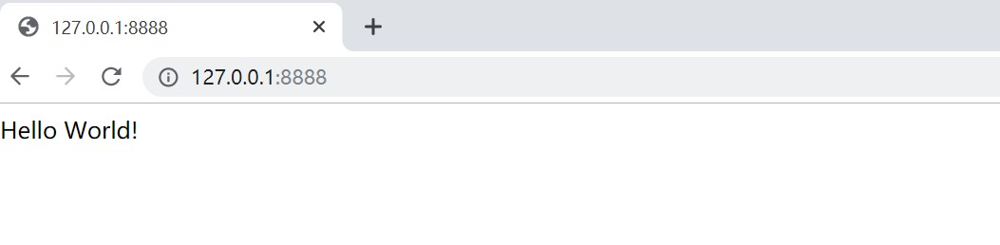
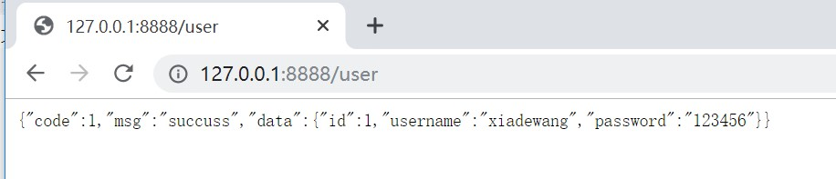
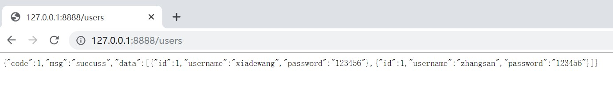
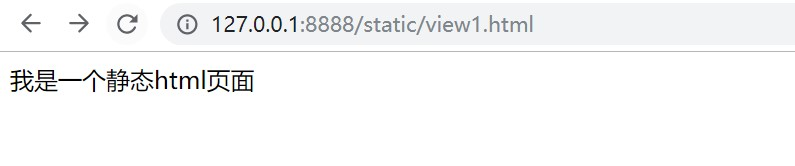
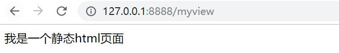

# springboot中控制器的使用
## @RestController的使用，生成rest api
下面用一个案例来演示，分别输出一个普通字符串、一个普通json、一个json数组结构
在做前后端分离项目时，我们往往会创建一个Result类，里面封装code、msg、data。具体代码如下

```java
package com.xdw.springbootdemo2.model;

public class Result<T> {
    private Integer code;   //状态识别码，1代表数据请求成功，其他为错误码
    private String msg;     //消息内容，请求发生错误的时候的内容，正确的时候为"success"
    private T data;     //具体数据

    public Integer getCode() {
        return code;
    }

    public void setCode(Integer code) {
        this.code = code;
    }

    public String getMsg() {
        return msg;
    }

    public void setMsg(String msg) {
        this.msg = msg;
    }

    public T getData() {
        return data;
    }

    public void setData(T data) {
        this.data = data;
    }
}

```

再编写一个User.java

```Java
package com.xdw.springbootdemo2.model;

public class User {
    private Integer id;
    private String username;
    private String password;

    public Integer getId() {
        return id;
    }

    public void setId(Integer id) {
        this.id = id;
    }

    public String getUsername() {
        return username;
    }

    public void setUsername(String username) {
        this.username = username;
    }

    public String getPassword() {
        return password;
    }

    public void setPassword(String password) {
        this.password = password;
    }
}

```

然后我们创建一个控制器UserController

```java
package com.xdw.springbootdemo2.controller;

import com.xdw.springbootdemo2.model.Result;
import com.xdw.springbootdemo2.model.User;
import org.springframework.web.bind.annotation.RequestMapping;
import org.springframework.web.bind.annotation.RestController;

import java.util.ArrayList;
import java.util.List;

@RestController
public class UserController {

    @RequestMapping("/")
    public String index(){
        return "Hello World!";
    }

    @RequestMapping("/user")
    public Result<User> user(){
        Result<User> result = new Result<>();
        User user = new User();
        user.setId(1);
        user.setUsername("xiadewang");
        user.setPassword("123456");
        result.setCode(1);
        result.setMsg("succuss");
        result.setData(user);
        return result;
    }

    @RequestMapping("/users")
    public Result<List<User>> users(){
        Result<List<User>> result = new Result<>();
        List<User> userList = new ArrayList<>();
        User user = new User();
        user.setId(1);
        user.setUsername("xiadewang");
        user.setPassword("123456");
        userList.add(user);
        User user2 = new User();
        user2.setId(1);
        user2.setUsername("zhangsan");
        user2.setPassword("123456");
        userList.add(user2);
        result.setCode(1);
        result.setMsg("succuss");
        result.setData(userList);
        return result;
    }
}

```

在这个控制器中我们定义了3个方法，三个方法分别返回普通字符串、json、带数组结构的json
在浏览器中的测试结果分别如下：





至此我们发现，通过springboot构建一个rest api返回json数据非常方便，之前使用过spring+springmvc框架的同学要想实现这个简单功能需要写好多xml配置才能实现吧。

## 使用springmvc自带的@Controller直接跳转html页面（不带模板引擎的），配合@ResponseBody实现rest api

我们首先在工程自带的resources/static路径下创建一个静态html文件view1.html

```html
<!DOCTYPE html>
<html lang="en">
<head>
    <meta charset="UTF-8">
    <title>Title</title>
</head>
<body>
我是一个静态html页面
</body>
</html>
```

然后我们在application.properties中添加静态资源映射

```properties
#服务器端口
server.port=8888
#静态资源映射
spring.resources.static-locations=classpath:/static/
spring.mvc.static-path-pattern=/static/**
```

这里顺带配置了服务器端口号，关于该配置文件后面再单独开个章节进行细讲。
此时配置完成之后，我们其实可以直接在浏览器中输入地址进行静态资源的访问，如下图


下面我们编写控制器代码，采用控制器进行跳转

```java
package com.xdw.springbootdemo2.controller;

import org.springframework.stereotype.Controller;
import org.springframework.web.bind.annotation.RequestMapping;

@Controller
public class ViewAndRestController {
    @RequestMapping("/myview")
    public String myview(){
        System.out.println("myview");
        return "static/view1.html";
    }
}

```

跳转界面的方法的返回类型统一使用String，此时我们在浏览器中输入控制器中映射的地址进行跳转，如下图



其实此时配置的静态文件映射不光只针对html页面，还有对图片、css、js等文件的映射。后面将静态文件放置到这个已经配置好的static文件夹下即可。当然也可以自行创建一个文件夹然后再来进行配置。
下面我们进一步修改ViewAndRestController的代码，让其不光可以跳转页面，还可以输出json吧，代码很简单，只用配合一个@ResponseBody即可。

```java
package com.xdw.springbootdemo2.controller;

import com.xdw.springbootdemo2.model.Result;
import com.xdw.springbootdemo2.model.User;
import org.springframework.stereotype.Controller;
import org.springframework.web.bind.annotation.RequestMapping;
import org.springframework.web.bind.annotation.ResponseBody;

@Controller
public class ViewAndRestController {
    @RequestMapping("/myview")
    public String myview(){
        System.out.println("myview");
        return "static/view1.html";
    }

    @RequestMapping("/user2")
    @ResponseBody
    public Result<User> user(){
        Result<User> result = new Result<>();
        User user = new User();
        user.setId(1);
        user.setUsername("xiadewang");
        user.setPassword("123456");
        result.setCode(1);
        result.setMsg("succuss");
        result.setData(user);
        return result;
    }
}

```

## 小结与坑点
1、@RestController是对class进行注解，该注解下的所有被@RequestMapping注解的方法最终输出结果都为字符串，不会跳转界面。
2、采用@Controller注解class，然后采用@RequestMapping注解的方法的返回值类型设置为String，可以进行界面跳转。这里是直接跳转html静态页面，所以需要配置静态资源访问映射。后面我们会讲解常用的几种页面模板引擎的使用。
3、在@Controller注解的class中，想输出字符串，可以在@RequestMapping注解的方法上再添加一个@ResponseBody注解。
4、如果在跳转界面的方法上不小心加上了@ResponseBody注解，则不能跳转界面了，而是输出的字符串。