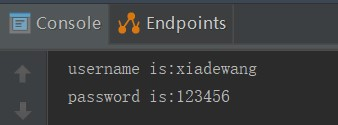
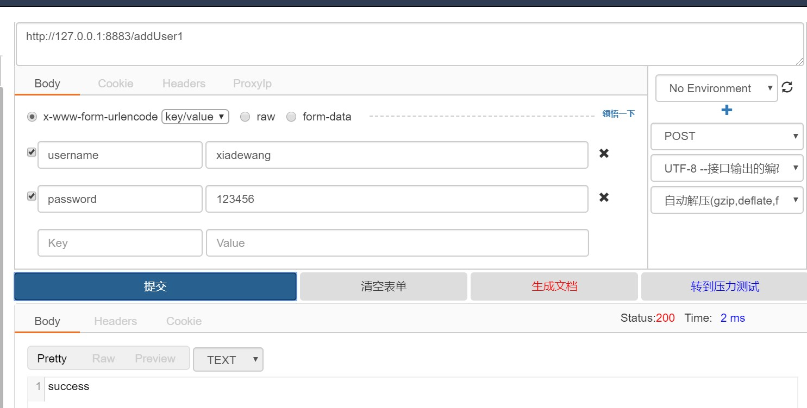
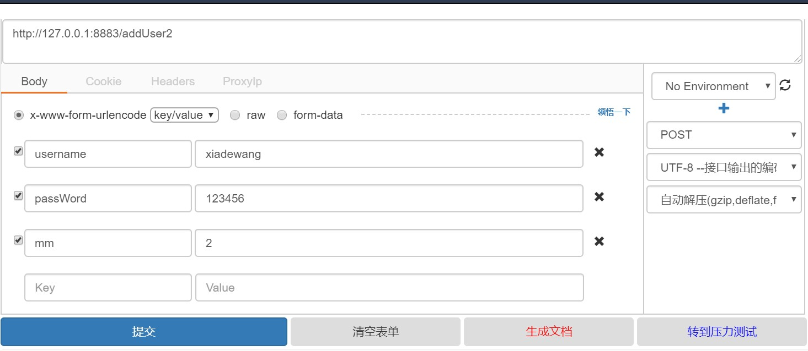
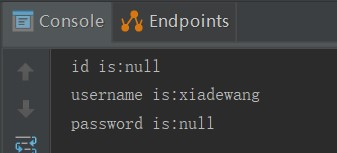
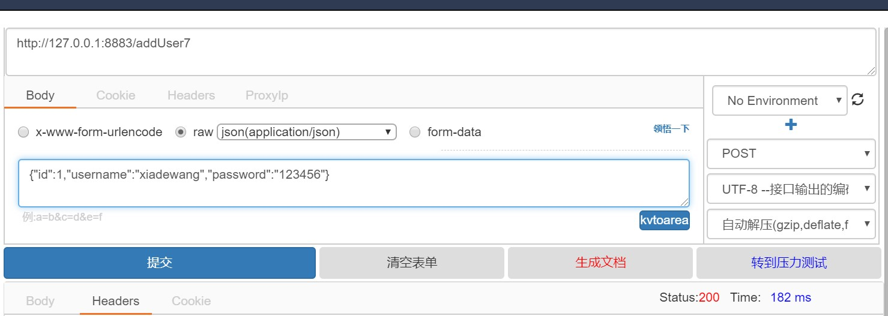
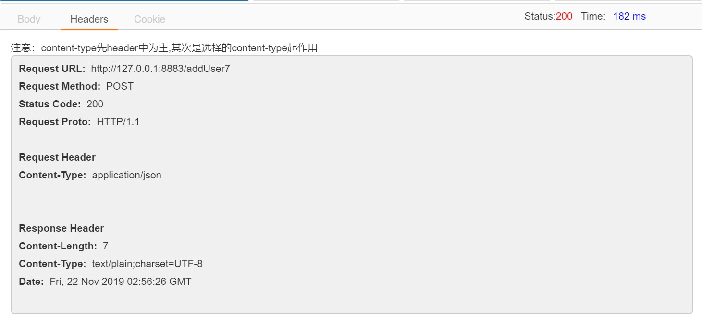
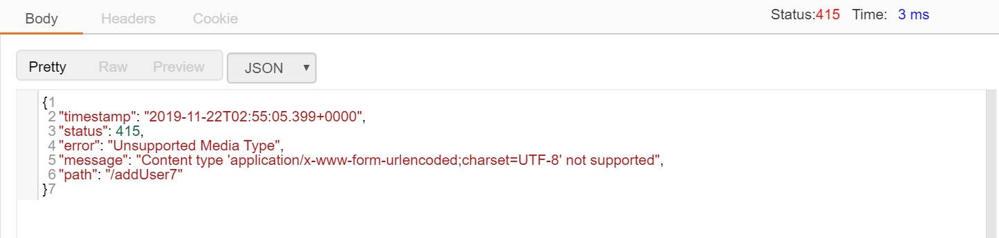
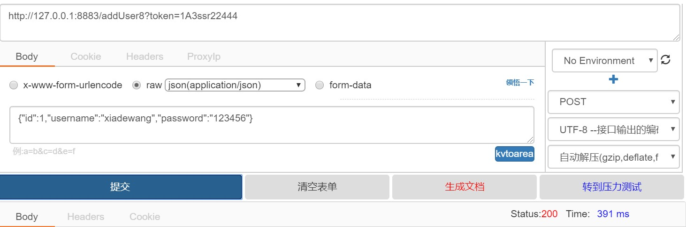
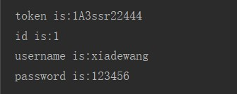

# springboot获取URL的请求参数
　　下面介绍七种服务端获取前端传递过来的参数的方法，我们这里只编写后端代码，前端部分可以使用postman这样的测试工具来进行模拟。常用的方法为：@RequestParam和@RequestBody

## 1、直接把请求参数写在Controller相应的方法的形参中，此场景适用于请求参数较少的情况

```java
    /**
     * 1.直接把请求参数写在Controller相应的方法的形参中
     * @param username
     * @param password
     * @return
     */
    @RequestMapping("/addUser1")
    public String addUser1(String username,String password) {
        System.out.println("username is:"+username);
        System.out.println("password is:"+password);
        return "success";
    }
```

测试方法如下，此处的RequestMapping中没有限定请求方式，那么get和post的请求方式都是可以接收的。get的请求方式我们可以直接在浏览器中输入地址，端口可以自行在application.properties中配置
http://127.0.0.1:8883/addUser1?username=xiadewang&password=123456
测试结果可以查看控制台打印


同时我们还可以使用postman这类工具进行post测试，如下图


## 2、封装一个bean来接收，我们这里使用上一个案例中封装好的User类来进行接收，同时适用get、post方法。

User类的代码如下：
```java
package com.xdw.springbootdemo3.model;

public class User {
    private Integer id;
    private String username;
    private String password;

    public Integer getId() {
        return id;
    }

    public void setId(Integer id) {
        this.id = id;
    }

    public String getUsername() {
        return username;
    }

    public void setUsername(String username) {
        this.username = username;
    }

    public String getPassword() {
        return password;
    }

    public void setPassword(String password) {
        this.password = password;
    }
}

```

UserController中的代码如下：
```java
    /**
     * 2、封装一个bean来接收
     * @param user
     * @return
     */
    @RequestMapping("/addUser2")
    public String addUser2(User user) {
        System.out.println("id is:"+user.getId());
        System.out.println("username is:"+user.getUsername());
        System.out.println("password is:"+user.getPassword());
        return "success";
    }
```

此时我们可以继续使用postman进行测试，注意这里传入的参数名要和User里面的属性名称一致（首字母之外的大小写保持一致），否则无法识别接收，则相应的值会为null，比如

得到的结果如下

我们这里没有传入id的值，因此为null，传入的password中间有大小写不一致也为null，多传入的参数mm没有影响，不会报错。
## 3、通过原生的HttpServletRequest接收，同时适用get、post方法。

```java
    /**
     * 3、通过原生的HttpServletRequest接收
     * @param request
     * @return
     */
    @RequestMapping("/addUser3")
    public String addUser3(HttpServletRequest request) {
        String username=request.getParameter("username");
        String password=request.getParameter("password");
        System.out.println("username is:"+username);
        System.out.println("password is:"+password);
        return "success";
    }
```

测试方法同上，这里就不再演示。

## 4、通过@PathVariable获取rest风格请求路径中的参数
```java
    /**
     * 4、通过@PathVariable获取rest风格请求路径中的参数
     * @param username
     * @param password
     * @return
     */
    @RequestMapping(value="/addUser4/{username}/{password}")
    public String addUser4(@PathVariable String username, @PathVariable String password) {
        System.out.println("username is:"+username);
        System.out.println("password is:"+password);
        return "success";
    }
```
此时测试访问路径应该是rest风格的路径，如http://127.0.0.1:8883/addUser4/xiadewang/123456
自动将URL中模板变量{username}和{password}绑定到通过@PathVariable注解的同名参数上，即入参后username=xiadewang、password=123456。注意这里的参数个数一定要保持相同，否则会报404的错误。

## 5、使用@ModelAttribute注解请求参数，同时适用get、post方法。
```java
    /**
     * 5、使用@ModelAttribute注解请求参数
     * @param user
     * @return
     */
    @RequestMapping(value="/addUser5")
    public String addUser5(@ModelAttribute("user") User user) {
        System.out.println("id is:"+user.getId());
        System.out.println("username is:"+user.getUsername());
        System.out.println("password is:"+user.getPassword());
        return "success";
    }
```
## 6、使用注解@RequestParam绑定请求参数到方法形参，同时适用get、post方法。
```java
    /**
     * 6、使用注解@RequestParam绑定请求参数到方法形参
     * @param username
     * @param password
     * @return
     */
    @RequestMapping(value="/addUser6")
    public String addUser6(@RequestParam("username") String username, @RequestParam("password") String password) {
        System.out.println("username is:"+username);
        System.out.println("password is:"+password);
        return "success";
    }
```
注意：当请求参数username或者password不存在时会有异常发生,可以通过设置属性required=false解决,例如: @RequestParam(value="username", required=false)

## 7、使用注解@RequestBody绑定请求参数到方法形参，只适用post方法。
```java
    /**
     * 7、用注解@Requestbody绑定请求参数到方法入参
     * @param user
     * @return
     */
    @RequestMapping(value="/addUser7")
    public String addUser7(@RequestBody User user) {
        System.out.println("id is:"+user.getId());
        System.out.println("username is:"+user.getUsername());
        System.out.println("password is:"+user.getPassword());
        return "success";
    }
```
关于最后这个@RequestBody要重点讲解下，此时前端发送请求不能使用get方式，需要使用post方式，还有请求传递的参数需要是json字符串，这里重点要设置的是Content-Type，要将其设置为application/json。我们此时使用postman测试如下


这里如果不设置content-type的话，会报如下错误


## 小结
　　springboot获取URL请求方式的七种方式到此介绍完毕，根据自己的业务需求和喜好进行选择吧，本人使用最多的是1、2、4、6、7这几种方式吧。下面我们再来对@RequestBody重点讲解下，写一个@RequestBody和@RequestParam同时使用的场景，代码如下
```java
  /**
     * @Requestbody和@RequestParam同时使用
     * @param user
     * @param token
     * @return
     */
    @RequestMapping(value="/addUser8")
    public String addUser8(@RequestBody User user,@RequestParam("token") String token) {
        System.out.println("token is:"+token);
        System.out.println("id is:"+user.getId());
        System.out.println("username is:"+user.getUsername());
        System.out.println("password is:"+user.getPassword());
        return "success";
    }
```
使用postman进行测试

测试结果如下：
