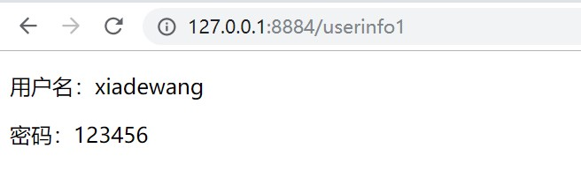
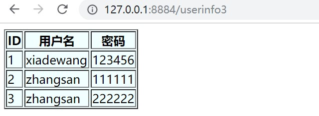

# springboot模板引擎使用之Thymeleaf
　　现在开发的主流是采用前后端分离，后端使用springboot进行开发标准的rest接口，web前端采用ajax或者vue.js中的网络请求，Android、IOS、小程序等也都有自己的网络请求框架，这样一套web后台程序就可以支撑web端和移动端开发，减少了开发成本和维护成本。但是这种模式不利于SEO，并且在性能上也会稍微差一点，还有一些场景，使用模板引擎会更方便，开发起来也更快速点。本章主要讲解springboot与模板引擎Thymeleaf的集成。
## 1、开始集成Thymeleaf
　　第一步：引入依赖（thymeleaf对应的starter），IDEA创建springboot模板时可以在可视化向导中勾选：
　　

```xml
        <dependency>
            <groupId>org.springframework.boot</groupId>
            <artifactId>spring-boot-starter-thymeleaf</artifactId>
        </dependency>
```

 　　第二步：配置thymeleaf，这里使用的是在application.properties中配置： 

```properties
#指定模板所在的目录
spring.thymeleaf.classpath=/templates/
#检查模板路径是否存在
spring.thymeleaf.check-template-location=true
#是否缓存，开发模式下设置为false，避免改了模板还要重启服务器，线上设置为true，可以提高性能。
spring.thymeleaf.cache=false
#模板文件后缀名
spring.thymeleaf.suffix= .html
#编码格式
spring.thymeleaf.encoding=UTF-8
#content-type
spring.thymeleaf.servlet.content-type=text/html
#spring.thymeleaf.mode的默认值是HTML5，其实是一个很严格的检查，改为LEGACYHTML5可以得到一个可能更友好亲切的格式要求。
#比如你在使用Vue.js这样的库，然后有<div v-cloak></div>这样的html代码，也被thymeleaf认为不符合要求而抛出错误。
spring.thymeleaf.mode = LEGACYHTML5
```

第三步：创建一个控制器，控制器这里必须采用@Controller进行注解，千万不要使用@RestController，编写如下代码

```java
package com.xdw.springbootdemo4.controller;

import org.springframework.stereotype.Controller;
import org.springframework.ui.Model;
import org.springframework.web.bind.annotation.GetMapping;
import org.springframework.web.bind.annotation.RequestMapping;
import org.springframework.web.bind.annotation.RequestParam;


@Controller
public class UserController {

    /**
     * 采用model往request域中存值，存入2个普通的字符串
     * @param model
     * @return
     */
    @GetMapping("/userinfo1")
    public String userinfo1(Model model) {
        String username = "xiadewang";
        String password = "123456";
        model.addAttribute("username", username);
        model.addAttribute("password", password);
        return "userinfo1";
    }
}

```

这里我们使用了@GetMapping注解，它相当于

```java
@RequestMapping(value = "/userinfo1",method = RequestMethod.GET)
```

是它的一个简化版写法。

在springboot中跳转模板页，统一将方法返回值设置为String即可，返回给模板引擎的数据可以通过在方法中加入形参Model来进行存储。

我们之前已经配置了模板引擎的前缀和后缀，我们在这里的返回值只用设置为模板页面的不带后缀的文件名即可。

第四步：在模板引擎配置的模板路径下创建模板页面，此处我们在Templete下创建一个userinfo1.html页面，代码如下

```html
<!DOCTYPE html>
<html lang="en" xmlns:th="http://www.thymeleaf.org">
<head>
    <meta charset="UTF-8">
    <title>Title</title>
</head>
<body>
<p th:text="'用户名：'+${username}"></p>
<p th:text="'密码：'+${password}"></p>
</body>
</html>
```

此处在html上加入了一个命名空间xmlns:th="http://www.thymeleaf.org"，代表可以用来引入thymeleaf的标签库，下面利用th标签和el表达式来获取后端传递过来的值。

运行效果如下图



至此最简单的一个springboot融合thymeleaf模板引擎的案例完成了。

# 2、传回对象数据给模板引擎
在UserController中继续加入下面代码

```java
    /**
     * 采用model往request域中存值，存入一个user对象数据
     * @param model
     * @return
     */
    @RequestMapping(value = "/userinfo2",method = RequestMethod.GET)
    public String userinfo2(Model model) {
        User user =new User();
        user.setUsername("xiadewang");
        user.setPassword("123456");
        model.addAttribute("user",user);
        return "userinfo2";
    }
```

然后创建另外一个模板页面userinfo2.html

```
<!DOCTYPE html>
<html lang="en" xmlns:th="http://www.thymeleaf.org">
<head>
    <meta charset="UTF-8">
    <title>Title</title>
</head>
<body>
<p th:text="'用户名：'+${user.username}"></p>
<p th:text="'密码：'+${user.password}"></p>
</body>
</html>
```

## 3、传回集合数据给模板引擎
在UserController中继续加入下面代码

```java
 /**
     * 采用model往request域中存值，存入一个user集合数据
     * @param model
     * @return
     */
    @RequestMapping(value = "/userinfo3",method = RequestMethod.GET)
    public String userinfo3(Model model) {
        List<User> userList =new ArrayList<>();
        User user1 =new User();
        user1.setId(1);
        user1.setUsername("xiadewang");
        user1.setPassword("123456");
        User user2 =new User();
        user2.setId(2);
        user2.setUsername("zhangsan");
        user2.setPassword("111111");
        User user3 =new User();
        user3.setId(3);
        user3.setUsername("zhangsan");
        user3.setPassword("222222");
        userList.add(user1);
        userList.add(user2);
        userList.add(user3);
        model.addAttribute("users",userList);
        return "userinfo3";
    }
```

然后创建另外一个模板页面userinfo3.html

```html
<!DOCTYPE html>
<html lang="en" xmlns:th="http://www.thymeleaf.org">
<head>
    <meta charset="UTF-8">
    <title>Title</title>
</head>
<body>
<table border="1" bgcolor="#f0ffff">
    <thead>
    <tr>
        <th>ID</th>
        <th>用户名</th>
        <th>密码</th>
    </tr>
    </thead>
    <tbody th:each="user : ${users}">
    <tr>
        <td th:text="${user.id}"></td>
        <td th:text="${user.username}"></td>
        <td th:text="${user.password}"></td>
    </tr>
    </tbody>
</table>
</body>
</html>
```

运行结果如下：



# 小结
　　关于thymeleaf模板的集成就讲到这里，更多关于thymeleaf模板的语法请参见thymeleaf官网